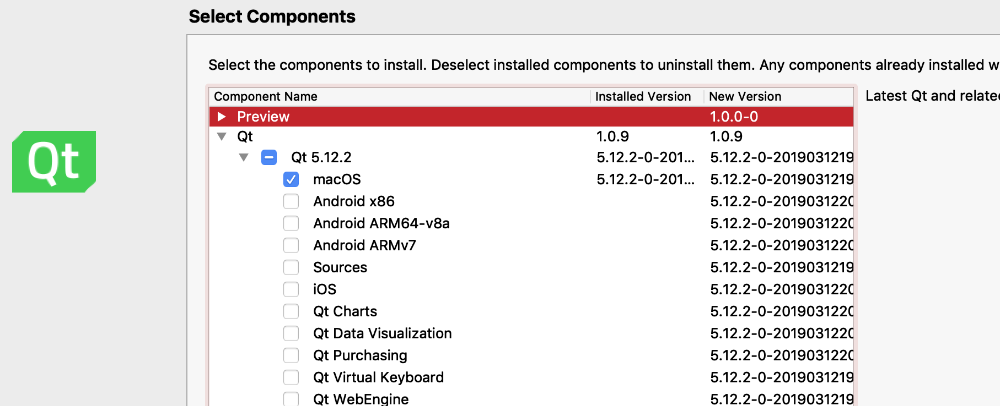

# Basic install instructions

 - Download the Qt SDK installer from https://www.qt.io/download

 - For the most part, you need Qt 5.12.x or above. In the Qt installer, you specify:
   
   Only tick off the platforms you need, as each platform incurs a big download.

 - Once the installation is finished, clone the repository and open the directory in Qt Creator.
   Qt Creator should automatically open it as a CMake project.

# Deployment??

If you want to deploy the project as a self-contained program, you will need to use your platforms \*deployqt (eg. `windeployqt`, `macdeployqt`, `linuxdeployqt`)

You will then run

    \*deployqt --qmldir=$PROJECT_DIR/src ../BonziRevolutions{.exe}

This will:
 - Bundle all Qt shared libraries
 - Bundle all used QML modules

